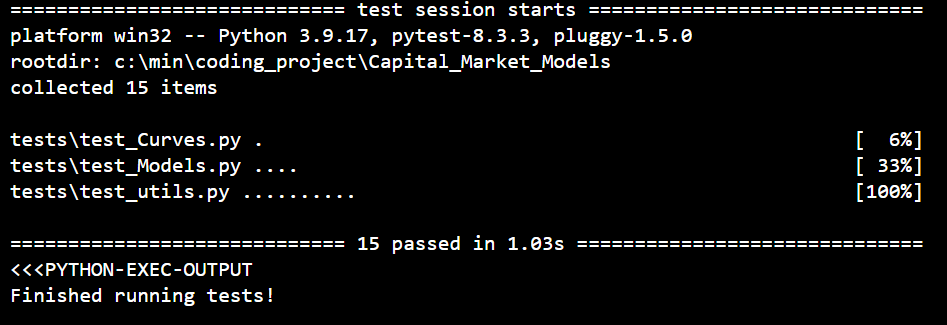

# Capital_Market_Models

## This project is to demonstrate my understanding about 1-factor Hull-White interest rate model including yield curves manipulation, no-arbitrage model calibration, and derivatives pricing with trinomial algorithm (recursion with memoization is used to implement the algorithm).
### To make the code easy to understand, OOP is used to divide the code contents from the main class (HW_model class) to many groups as follows.
- Models.py: This is the main pricing code where trinomial algorithm is implemented (HW_model class).
- Curves.py: This contains 2 classes, Zcb_curve and Vol_curve, to handle yield curves, cap and caplet volatility term structures.
- Securities.py: This contains Security classes for European, American and Bermudan Swaptions and simple Caplets (for unittest on trinomial algorithm only, reference: Prof. Neil D. Pearson @ UIUC), which can be price by HW_model class.
- utils.py: This contains basic but frequently used code for cap/caplets pricing, numerical methods for implied volatility, yield curve handling.
- Templates.py: This contains the templates (mother classes) of many classes used in this application.
- tests: The folder contains several test cases for unittest to ensure the reliability of the developed code.

### To install and check for compatibility, run build.sh or execute the following command
- pip install -r requirements.txt
- pytest
The second command is just for checking the unittest cases

You should see no errors from 15 test cases.

Kamin At, MSFE student @ UIUC